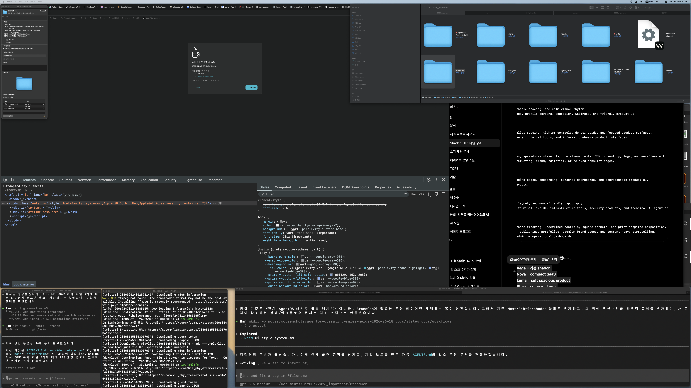

# AgentOS Operating Rules Merge Plan

Date: 2026-06-18

## Request

Merge the newly introduced AgentOS operating rules into the existing BrandGen rules in a non-destructive way, organize the old and new rules, and prevent conflicts.

## Before Screenshot

## Existing Rules To Preserve

- Next.js version warning: read relevant `node_modules/next/dist/docs/` guidance before Next.js code changes.
- Fabric work notes: plan note, before/after screenshots, completion report for meaningful implementation work.
- shadcn/ui style rules: use `docs/ui-style-system.md` for UI density, spacing, radius, and tone decisions.

## Introduced Rule Direction

Use the AgentOS Foundation v2.4 intent without unpacking the whole ZIP into the repo:

- keep `AGENTS.md` as the lightweight first-read router
- classify the user request before reading extra docs
- avoid broad repo or docs scans
- perform one bounded task at a time
- require approval before package installs, init, registry/MCP setup, destructive actions, or large file moves
- protect secrets and personal data from logs and reports
- prefer targeted verification over broad checks unless the change warrants more

## Non-Destructive Merge Approach

1. Add an operating-rule precedence block near the top of `AGENTS.md`.
2. Keep the existing Next/Fabric/shadcn blocks intact.
3. Add minimal state and workflow docs only where the new router points.
4. Clarify that BrandGen local rules override generic AgentOS defaults when they are more specific.
5. Add a completion report with verification and remaining risks.

## Planned Files

- `AGENTS.md`
- `docs/states/project-state.md`
- `docs/states/task-board.md`
- `docs/states/work-state.md`
- `docs/workflows/01-general-task.md`
- `docs/workflows/02-feature-development.md`
- `docs/workflows/03-bugfix-flow.md`
- `docs/workflows/04-refactoring-flow.md`
- `docs/workflows/05-release-flow.md`
- `docs/workflows/06-ui-implementation.md`
- `docs/workflows/07-iteration-verification.md`
- `notes/agentos-operating-rules-merge-report.md`
- `notes/screenshots/agentos-operating-rules-merge-2026-06-18/`

## Verification

- Confirm no existing rule block was removed.
- Confirm new router references existing files.
- Confirm AgentOS-style approval and routing rules are present.
- Review the final diff.
