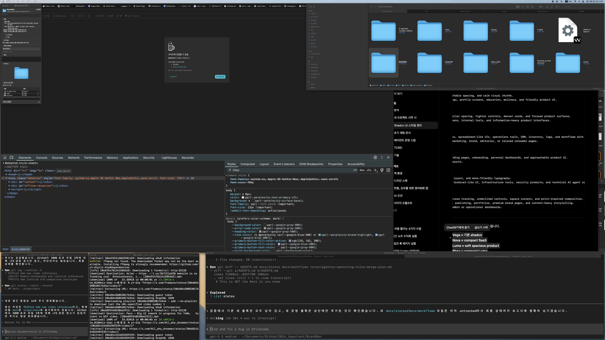

# AgentOS Operating Rules Merge Report

Date: 2026-06-18

## Summary

Merged the AgentOS Foundation v2.4 operating intent into BrandGen without
overwriting the existing rules.

The repo now has a lightweight first-read router in `AGENTS.md`, minimal state
docs in `docs/states/`, and compact workflow docs in `docs/workflows/`. Existing
Next.js, Fabric Work Notes, and shadcn/ui style rules remain intact.

## Before / After

### Before


### After



## Existing Rules Preserved

- Next.js warning block remains unchanged.
- Fabric Work Notes remain unchanged and still require plan notes, screenshots, and completion reports for meaningful implementation work.
- shadcn/ui Style Rules remain unchanged and still route UI decisions to `docs/ui-style-system.md`.

## New Operating Rules Introduced

- `AGENTS.md` now defines rule priority.
- Future agents should read `AGENTS.md` first and avoid broad `docs/` or `notes/` scans by default.
- Code/documentation changes route through `docs/states/` and one matching `docs/workflows/` file.
- Work is bounded to one task at a time.
- Explicit approval phrases are required before continuing to the next queued task.
- Package installs, init, registry additions, MCP setup, destructive commands, and large file moves require approval.
- Secrets and personal data must not be emitted into logs, notes, reports, or handoffs.

## Conflict Resolution

- More specific BrandGen rules override generic AgentOS defaults.
- AgentOS package files were not unpacked wholesale, so existing BrandGen notes and docs were not replaced.
- The router references only files that now exist locally.
- Fabric reporting and screenshots are kept as the project-specific completion contract.
- shadcn/ui visual rules remain the UI-specific authority.

## Files Changed

- `AGENTS.md`
- `docs/states/work-state.md`
- `docs/states/task-board.md`
- `docs/states/project-state.md`
- `docs/workflows/01-general-task.md`
- `docs/workflows/02-feature-development.md`
- `docs/workflows/03-bugfix-flow.md`
- `docs/workflows/04-refactoring-flow.md`
- `docs/workflows/05-release-flow.md`
- `docs/workflows/06-ui-implementation.md`
- `docs/workflows/07-iteration-verification.md`
- `notes/agentos-operating-rules-merge-plan.md`
- `notes/agentos-operating-rules-merge-report.md`
- `notes/screenshots/agentos-operating-rules-merge-2026-06-18/before-fullscreen.png`
- `notes/screenshots/agentos-operating-rules-merge-2026-06-18/after-fullscreen.png`

## Verification

Command:

```bash
rg -n "BEGIN:brandgen-agentos-operating-rules|BEGIN:nextjs-agent-rules|BEGIN:fabric-work-notes|BEGIN:shadcn-style-rules|docs/states/work-state.md|docs/workflows/06-ui-implementation.md|진행해줘|비밀번호|secrets" AGENTS.md docs/states docs/workflows notes/agentos-operating-rules-merge-plan.md
```

Result:

- Passed. The new router, existing rule blocks, state/workflow references, approval phrases, and data-protection rule are present.

Command:

```bash
find docs/states docs/workflows -type f | sort
```

Result:

- Passed. The router target files exist locally.

Command:

```bash
git diff -- AGENTS.md docs/states docs/workflows notes/agentos-operating-rules-merge-plan.md
```

Result:

- Reviewed. The existing `AGENTS.md` blocks are preserved; the new block is additive.

## Remaining Risks

- This is documentation-only operating-rule work; no runtime build was run.
- The workflow docs are intentionally compact. Expand them later only when repeated work shows a real need.
