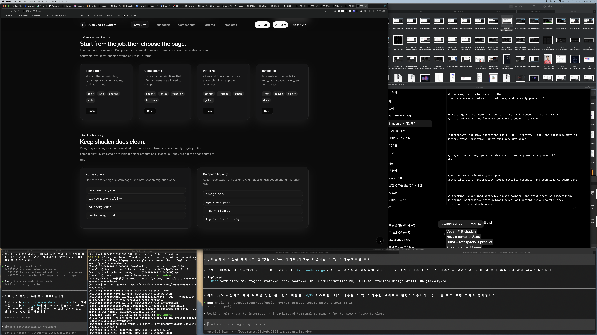
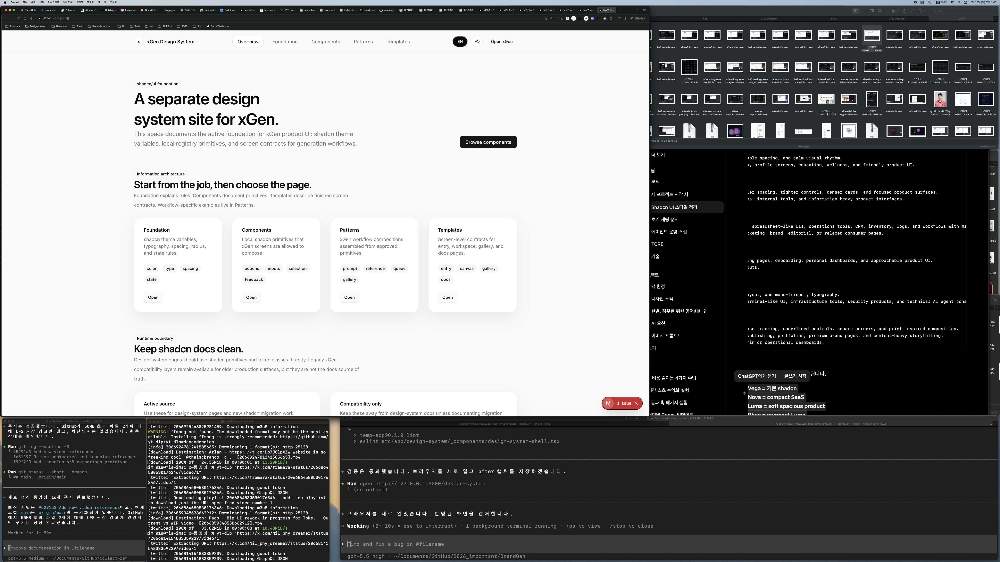

# Design System Compact Toggle Buttons Report

Date: 2026-06-18

## Summary

Updated the `/design-system` header preference buttons to remove extra labels.

The language control now shows only `KO` or `EN`. The theme control now shows
only the sun/moon icon. Both controls keep fixed dimensions so toggling does not
shift the header layout.

## Before / After

### Before



### After



## Files Changed

- `src/app/design-system/_components/design-system-shell.tsx`
- `src/app/globals.css`
- `notes/design-system-compact-toggle-buttons-plan.md`
- `notes/design-system-compact-toggle-buttons-report.md`
- `notes/screenshots/design-system-compact-toggle-buttons-2026-06-18/before-fullscreen.png`
- `notes/screenshots/design-system-compact-toggle-buttons-2026-06-18/after-fullscreen.png`

## What Changed

- Removed the language icon.
- Changed language display from `한` / `EN` to `KO` / `EN`.
- Removed theme text labels.
- Kept the theme control as icon-only using the existing sun/moon icons.
- Added `data-variant="text"` and `data-variant="icon"` control variants.
- Fixed dimensions:
  - text preference button: `width: 2.75rem`
  - icon preference button: `width: 2rem`

## Verification

Command:

```bash
npm run lint -- src/app/design-system/_components/design-system-shell.tsx
```

Result:

- Passed.

Command:

```bash
curl -s -I --max-time 10 http://127.0.0.1:3000/design-system
```

Result:

- Passed. Returned `HTTP/1.1 200 OK`.

Command:

```bash
rg -n "Languages|PreferenceButton|label=\\{locale|KO|EN|data-variant|data-slot=\\\"design-system-preference-icon\\\"|width: 2\\.75rem|width: 2rem|라이트|다크|Light|Dark" src/app/design-system/_components/design-system-shell.tsx src/app/globals.css
```

Result:

- Passed. `Languages` is no longer imported, language uses `KO` / `EN`, the
  theme button renders an icon slot, and fixed width variant styles are present.

## Remaining Risks

- The screenshot was captured in the current desktop workspace. The fixed sizes
  are CSS-defined and should not shift across language/theme states.
