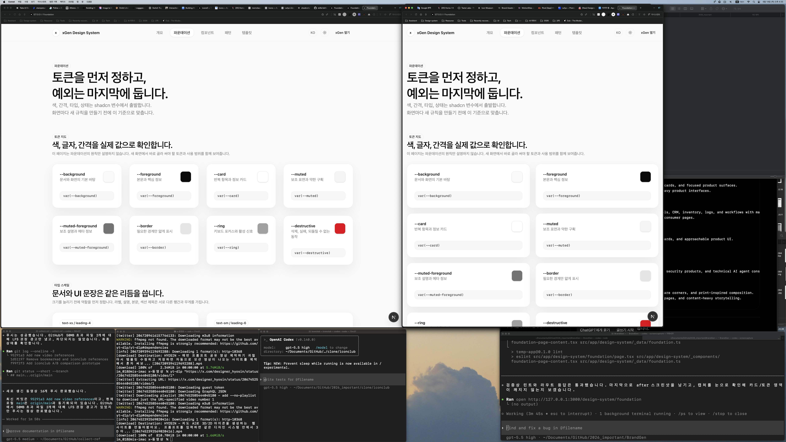

# Design System Foundation Content Report

Date: 2026-06-18
Route: `/design-system/foundation`

## Summary

Expanded the foundation page from a small set of principle cards into a practical reference for the xGen design-system foundation. The page now shows concrete color tokens, type scale, spacing scale, radius scale, and state rules before the existing baseline and runtime boundary sections.

## Before


## After



## Files Changed

- `src/app/design-system/foundation/page.tsx`
  - Added the new foundation content block above the older baseline cards.
- `src/app/design-system/_components/foundation-page-content.tsx`
  - Added dedicated foundation reference UI for color, type, spacing, radius, and state rules.
- `src/app/design-system/_data/foundation.ts`
  - Added the concrete foundation token data used by the page.
- `notes/design-system-foundation-content-plan-2026-06-18.md`
  - Added the implementation plan.
- `notes/screenshots/design-system-foundation-content-2026-06-18/`
  - Added before and after full-screen screenshots.

## Verification

```bash
npm run lint -- src/app/design-system/foundation/page.tsx src/app/design-system/_components/foundation-page-content.tsx src/app/design-system/_data/foundation.ts
```

Result: passed.

```bash
curl -s -I --max-time 10 http://127.0.0.1:3000/design-system/foundation
```

Result: `HTTP/1.1 200 OK`.

```bash
npm run build:next
```

Result: passed. Next.js generated `/design-system/foundation` as a static route.

## Remaining Risks

- The page now has real foundation content, but it still references CSS variable names manually. If tokens move into a generated registry later, this page should read from that source instead.
- The full-screen captures include the current desktop workspace around the browser, as required by the repo note convention. The browser content itself shows the updated route.

