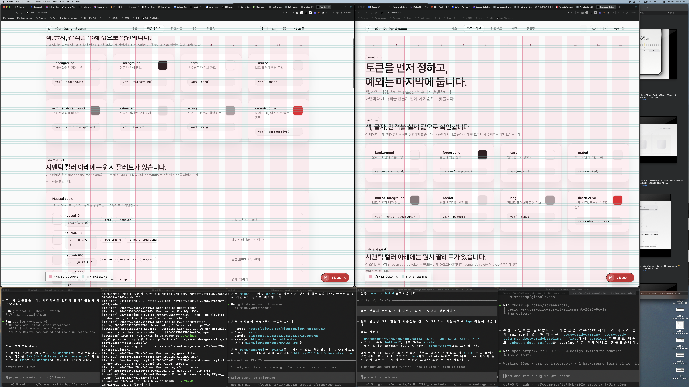

# Design System Grid Scroll Alignment Plan

Date: 2026-06-19
Route: `/design-system/*`

## Problem

The baseline overlay is currently fixed to the viewport. That makes it useful as a screen ruler, but wrong as a document layout reference: when the user scrolls, the baseline does not move with the page content.

## Before

## Scope

- Keep the existing header grid toggle.
- Keep column fills, column borders, column numbers, baseline color, and legend.
- Move the layout inspection grid from viewport-fixed positioning to document-surface positioning.
- Keep the overlay above the UI and non-interactive.

## Plan

1. Make `.shadcn-docs-surface` the positioning context.
2. Change `docs-grid-overlay`, `docs-grid-columns`, and `docs-grid-baseline` from `fixed` to `absolute`.
3. Keep the baseline origin aligned to the document/header offset, not the viewport scroll position.
4. Verify lint, route response, build, and after screenshot.

