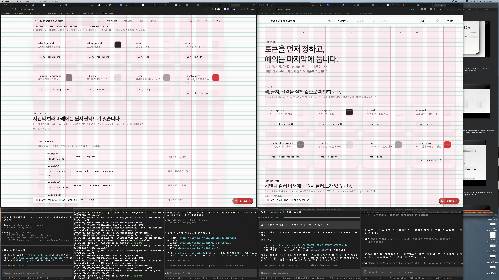

# Design System Grid Scroll Alignment Report

Date: 2026-06-19
Route: `/design-system/*`

## Summary

Changed the inspection overlay so the baseline grid is no longer fixed to the viewport. The grid overlay now uses the design-system surface as its positioning context, so columns and baseline lines move with the document content while scrolling.

## Before


## After



## Files Changed

- `src/app/globals.css`
  - Added `position: relative` to `.shadcn-docs-surface`.
  - Changed `docs-grid-overlay` from `fixed` to `absolute`.
  - Changed `docs-grid-columns` from `fixed` to `absolute`.
  - Changed `docs-grid-baseline` from `fixed` to `absolute`.
  - Kept the legend fixed so the inspection state remains visible.
- `notes/design-system-grid-scroll-alignment-plan-2026-06-19.md`
  - Added the implementation plan.
- `notes/screenshots/design-system-grid-scroll-alignment-2026-06-19/`
  - Added before and after full-screen captures.

## Verification

```bash
npm run lint -- src/app/design-system/_components/design-system-shell.tsx src/app/design-system/_components/design-system-preferences.tsx
```

Result: passed.

```bash
curl -s -I --max-time 10 http://127.0.0.1:3000/design-system/foundation
```

Result: `HTTP/1.1 200 OK`.

```bash
npm run build:next
```

Result: first run failed while removing `.next/server` with `ENOTEMPTY`; immediate retry passed. The passing run compiled successfully, completed TypeScript, and generated `/design-system/foundation` as a static route.

## Remaining Risks

- The legend intentionally remains fixed to the viewport. The layout lines themselves are document-bound and scroll with content.

