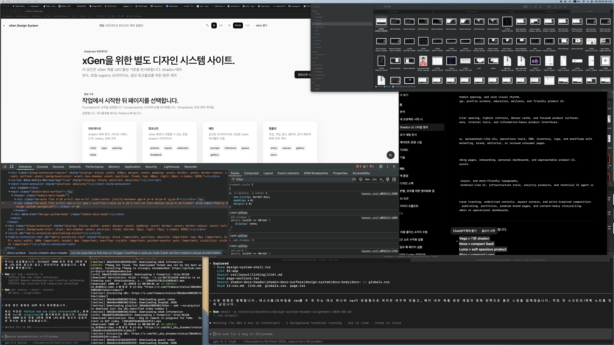
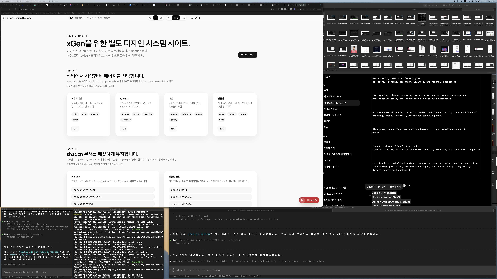

# Design System Header Alignment Report

Date: 2026-06-18

## Summary

Fixed the `/design-system` header alignment and navigation structure.

The header now uses one responsive nav instead of separate desktop and mobile
nav elements. The header rail is also constrained to align with the main docs
body rhythm instead of stretching to the wider `max-w-7xl` rail.

## Before / After

### Before



### After



## Files Changed

- `src/app/design-system/_components/design-system-shell.tsx`
- `notes/design-system-header-alignment-plan.md`
- `notes/design-system-header-alignment-report.md`
- `notes/screenshots/design-system-header-alignment-2026-06-18/before-fullscreen.png`
- `notes/screenshots/design-system-header-alignment-2026-06-18/after-fullscreen.png`

## What Changed

- Replaced the two-nav responsive pattern with one nav that moves from a second
  mobile row into the desktop center column.
- Changed the header inner rail from `max-w-7xl` to `max-w-[1184px]` so the
  padded content aligns with the `1120px` docs body rail.
- Increased desktop nav spacing from `gap-1` to `md:gap-3`.
- Increased nav link horizontal padding from `px-3` to `px-3.5`.
- Increased the right action group spacing to `gap-3`.

## Answer To The DOM Question

The previous structure had:

- one desktop nav inside the main header row, hidden below `md`
- one mobile nav directly under that row, hidden at `md` and above

That pattern is valid, but it made DevTools look like duplicate navigation and
split spacing decisions across two places. The new structure keeps one semantic
nav and changes only layout/order responsively.

## Verification

Command:

```bash
curl -s -I --max-time 10 http://127.0.0.1:3000/design-system
```

Result:

- Passed. Returned `HTTP/1.1 200 OK`.

Command:

```bash
npm run lint -- src/app/design-system/_components/design-system-shell.tsx
```

Result:

- Passed.

Command:

```bash
rg -n "<nav|Mobile design system navigation|max-w-\\[1184px\\]|gap-3|grid-cols-\\[auto_minmax" src/app/design-system/_components/design-system-shell.tsx
```

Result:

- Passed. There is one nav, the old mobile nav label is gone, and the new rail
  and gap classes are present.

## Remaining Risks

- This was verified on the currently open desktop browser view. If the intended
  target is a specific narrow viewport, run one more viewport-specific visual QA pass.
