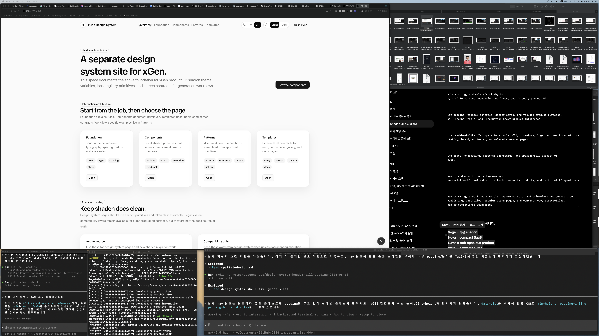
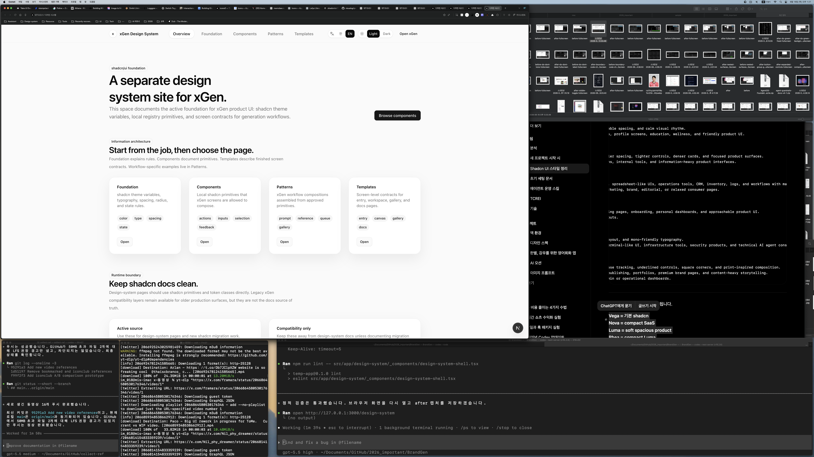

# Design System Header Pill Padding Report

Date: 2026-06-18

## Summary

Fixed the `/design-system` header menu pill padding.

The nav links now have a dedicated `data-slot="design-system-nav-link"` style
instead of relying on repeated active/inactive Tailwind padding branches. This
guarantees pill geometry, minimum height, line-height, and internal padding for
all header nav states.

## Before / After

### Before



### After



## Files Changed

- `src/app/design-system/_components/design-system-shell.tsx`
- `src/app/globals.css`
- `notes/design-system-header-pill-padding-plan.md`
- `notes/design-system-header-pill-padding-report.md`
- `notes/screenshots/design-system-header-pill-padding-2026-06-18/before-fullscreen.png`
- `notes/screenshots/design-system-header-pill-padding-2026-06-18/after-fullscreen.png`

## What Changed

- Added `data-slot="design-system-nav-link"` to the header nav links.
- Moved pill geometry into `.shadcn-docs-surface [data-slot="design-system-nav-link"]`.
- Set explicit nav link geometry:
  - `display: inline-flex`
  - `min-height: 2rem`
  - `padding: 0.375rem 0.875rem`
  - `line-height: 1.25rem`
  - shadcn radius-based rounding
- Kept active/inactive visual state in the component class names.

## Verification

Command:

```bash
npm run lint -- src/app/design-system/_components/design-system-shell.tsx
```

Result:

- Passed.

Command:

```bash
curl -s -I --max-time 10 http://127.0.0.1:3000/design-system
```

Result:

- Passed. Returned `HTTP/1.1 200 OK`.

Command:

```bash
rg -n "design-system-nav-link|min-height: 2rem|padding: 0\\.375rem 0\\.875rem|px-3\\.5|py-1\\.5" src/app/design-system/_components/design-system-shell.tsx src/app/globals.css
```

Result:

- Passed. The nav link slot and CSS padding exist, and the repeated `px-3.5` /
  `py-1.5` branches were removed from the component.

## Remaining Risks

- The screenshot check was done in the current desktop workspace. A narrow
  viewport pass is still useful if the mobile header needs separate sign-off.
