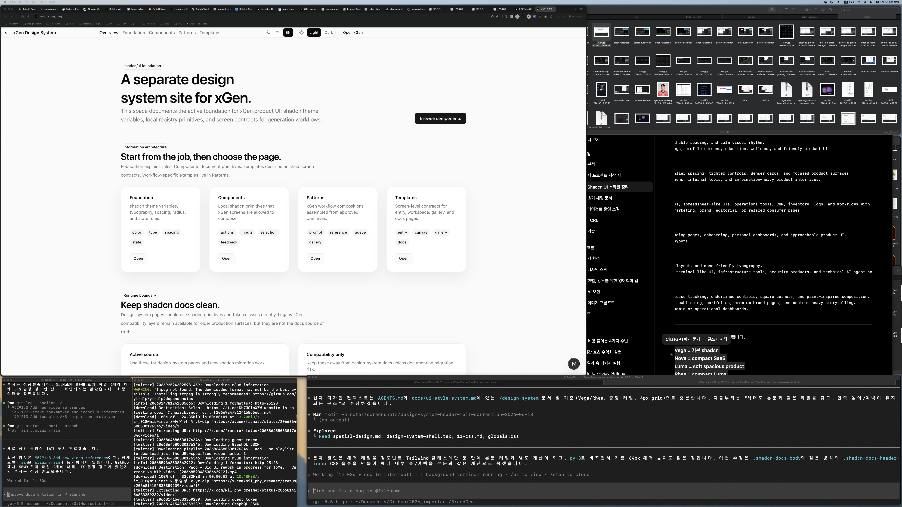
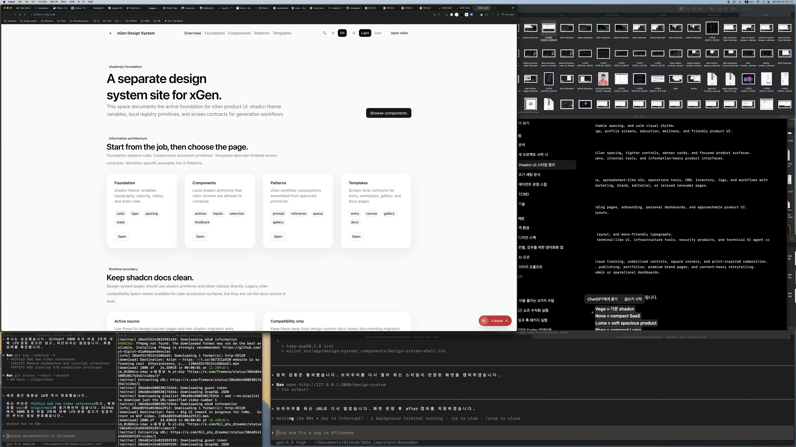

# Design System Header Rail Correction Report

Date: 2026-06-18

## Summary

Corrected the `/design-system` header rail and internal spacing after the first
header alignment pass still felt left-stuck and compressed.

The header now uses a dedicated `.shadcn-docs-header-inner` CSS slot with the
same rail formula as `.shadcn-docs-body`, so header content and page content
share one visual grid.

## Before / After

### Before



### After



## Files Changed

- `src/app/design-system/_components/design-system-shell.tsx`
- `src/app/globals.css`
- `notes/design-system-header-rail-correction-plan.md`
- `notes/design-system-header-rail-correction-report.md`
- `notes/screenshots/design-system-header-rail-correction-2026-06-18/before-fullscreen.png`
- `notes/screenshots/design-system-header-rail-correction-2026-06-18/after-fullscreen.png`

## What Changed

- Removed component-level `max-w-[1184px]` sizing from the header wrapper.
- Added `.shadcn-docs-header-inner` next to `.shadcn-docs-body`.
- Matched the header rail to the body rail:
  `width: min(calc(100% - 2rem), 1120px)`.
- Restored stable header breathing room with `min-height: 4rem` and
  `padding-block: 0.75rem`.
- Preserved the single semantic nav from the previous correction.

## Verification

Command:

```bash
npm run lint -- src/app/design-system/_components/design-system-shell.tsx
```

Result:

- Passed.

Command:

```bash
curl -s -I --max-time 10 http://127.0.0.1:3000/design-system
```

Result:

- Passed. Returned `HTTP/1.1 200 OK`.

Command:

```bash
rg -n "shadcn-docs-header-inner|max-w-\\[1184px\\]|<nav|Mobile design system navigation|width: min\\(calc\\(100% - 2rem\\), 1120px\\)|min-height: 4rem" src/app/design-system/_components/design-system-shell.tsx src/app/globals.css
```

Result:

- Passed. Header inner slot exists, the old component max-width is gone, and the
  single nav structure remains.

## Remaining Risks

- The browser screenshot was captured in the current desktop workspace. If this
  header must be signed off at exact mobile widths, run an additional narrow
  viewport pass.
