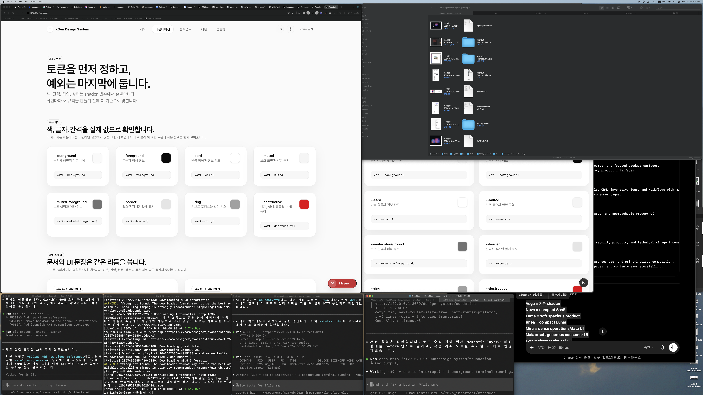

# Design System Semantic Color Plan

Date: 2026-06-18
Route: `/design-system/foundation`

## Problem

The foundation page now shows color token values, but color is still presented mostly as primitive variables. It needs a semantic layer that explains what information hierarchy and user meaning each color role carries.

## Before

## Scope

- Add semantic color role data without introducing new global color tokens.
- Keep shadcn source tokens as the implementation base.
- Show the relationship between semantic meaning, token pairs, and usage constraints.
- Keep the change scoped to `/design-system/foundation`.

## Plan

1. Add semantic color role records to the foundation data file.
2. Add a semantic color section near the existing primitive color token grid.
3. Make each role show meaning, allowed usage, token pair, and a visible preview.
4. Verify lint, route response, and build.

