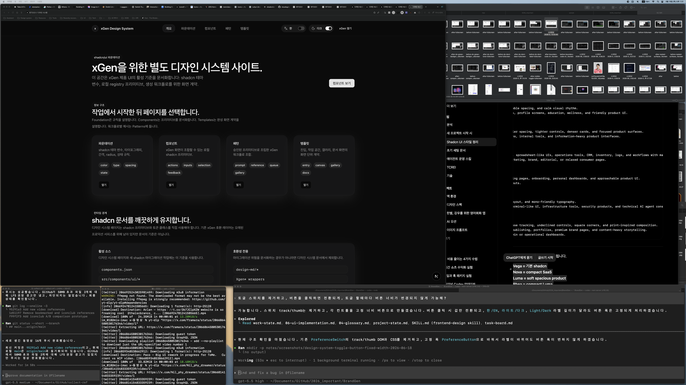

# Design System Toggle Button Fixed Width Plan

Date: 2026-06-18

## Request

Remove the visible toggle switch from the `/design-system` language and theme
controls. Keep each control as a button that toggles on click, and prevent width
changes when the label changes.

## Before Screenshot

## Plan

1. Replace `PreferenceSwitch` with a simpler `PreferenceButton`.
2. Remove track/thumb markup.
3. Replace switch CSS slots with a fixed-width button slot.
4. Keep `aria-pressed` because each button remains a toggle button.
5. Verify lint, HTTP response, targeted source checks, and after screenshot.

## Files

- `src/app/design-system/_components/design-system-shell.tsx`
- `src/app/globals.css`
- `notes/design-system-toggle-button-fixed-width-report.md`
- `notes/screenshots/design-system-toggle-button-fixed-width-2026-06-18/`
