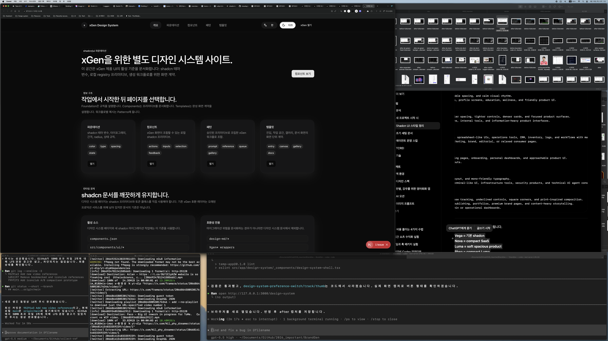

# Design System Toggle Button Fixed Width Report

Date: 2026-06-18

## Summary

Removed the visible switch track/thumb from the `/design-system` language and
theme controls. The controls are now fixed-width buttons that toggle state when
clicked.

## Before / After

### Before


### After



## Files Changed

- `src/app/design-system/_components/design-system-shell.tsx`
- `src/app/globals.css`
- `notes/design-system-toggle-button-fixed-width-plan.md`
- `notes/design-system-toggle-button-fixed-width-report.md`
- `notes/screenshots/design-system-toggle-button-fixed-width-2026-06-18/before-fullscreen.png`
- `notes/screenshots/design-system-toggle-button-fixed-width-2026-06-18/after-fullscreen.png`

## What Changed

- Replaced `PreferenceSwitch` with `PreferenceButton`.
- Removed switch track/thumb markup.
- Changed the control slot from `design-system-preference-switch` to
  `design-system-preference-button`.
- Set `width: 4.75rem` so the button width does not change when labels switch:
  - `한` / `EN`
  - `라이트` / `다크`
  - `Light` / `Dark`
- Kept `aria-pressed` because the button still represents a toggled state.

## Verification

Command:

```bash
npm run lint -- src/app/design-system/_components/design-system-shell.tsx
```

Result:

- Passed.

Command:

```bash
curl -s -I --max-time 10 http://127.0.0.1:3000/design-system
```

Result:

- Passed. Returned `HTTP/1.1 200 OK`.

Command:

```bash
rg -n "PreferenceSwitch|PreferenceButton|design-system-preference-(button|switch|track|thumb|label)|width: 4\\.75rem|aria-pressed|setLocale\\(|setTheme\\(" src/app/design-system/_components/design-system-shell.tsx src/app/globals.css
```

Result:

- Passed. The old switch component and track/thumb slots are gone, the fixed
  width button slot exists, and the buttons still toggle language/theme state.

## Remaining Risks

- The screenshot reflects the currently persisted dark theme. The fixed width is
  enforced in CSS and does not depend on theme.
