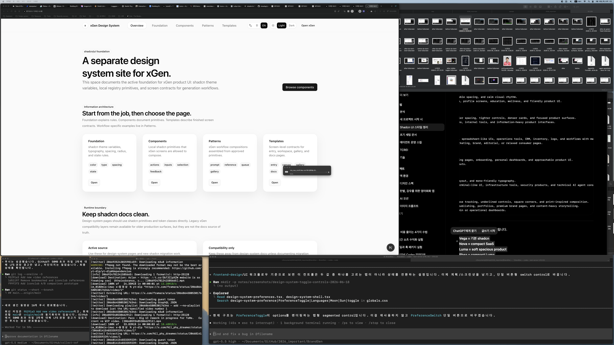

# Design System Toggle Controls Plan

Date: 2026-06-18

## Request

Change the `/design-system` header language and theme controls from tab-like
segmented controls into real toggle controls.

## Before Screenshot

## Current Problem

- `PreferenceToggle` renders multiple option buttons inside a bordered group.
- This reads as tabs/segmented control, not as a switch.
- The two settings are binary state changes:
  - language: Korean / English
  - theme: light / dark

## Plan

1. Replace `PreferenceToggle` with a single `PreferenceSwitch` button.
2. Each switch shows an icon, current state label, and a small switch track/thumb.
3. Clicking the language switch alternates `ko` and `en`.
4. Clicking the theme switch alternates `light` and `dark`.
5. Add dedicated CSS slots for the switch, label, track, and thumb.
6. Verify with lint, HTTP, targeted search, and after screenshot.

## Files

- `src/app/design-system/_components/design-system-shell.tsx`
- `src/app/globals.css`
- `notes/design-system-toggle-controls-report.md`
- `notes/screenshots/design-system-toggle-controls-2026-06-18/`
