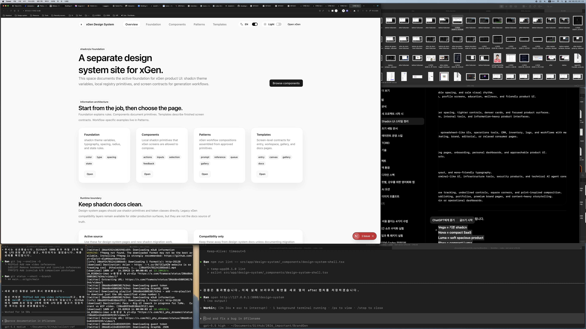

# Design System Toggle Controls Report

Date: 2026-06-18

## Summary

Changed the `/design-system` header language and theme controls from segmented
tab-style controls to single switch-style toggle buttons.

Each control now displays an icon, the current state label, and a small switch
track/thumb. Clicking the language switch alternates Korean and English.
Clicking the theme switch alternates light and dark.

## Before / After

### Before


### After



## Files Changed

- `src/app/design-system/_components/design-system-shell.tsx`
- `src/app/globals.css`
- `notes/design-system-toggle-controls-plan.md`
- `notes/design-system-toggle-controls-report.md`
- `notes/screenshots/design-system-toggle-controls-2026-06-18/before-fullscreen.png`
- `notes/screenshots/design-system-toggle-controls-2026-06-18/after-fullscreen.png`

## What Changed

- Replaced `PreferenceToggle` with `PreferenceSwitch`.
- Removed option mapping that rendered tab-like child buttons.
- Added single-button switch behavior:
  - language: `ko` <-> `en`
  - theme: `light` <-> `dark`
- Added dedicated CSS slots:
  - `design-system-preference-switch`
  - `design-system-preference-icon`
  - `design-system-preference-label`
  - `design-system-preference-track`
  - `design-system-preference-thumb`

## Verification

Command:

```bash
npm run lint -- src/app/design-system/_components/design-system-shell.tsx
```

Result:

- Passed.

Command:

```bash
curl -s -I --max-time 10 http://127.0.0.1:3000/design-system
```

Result:

- Passed. Returned `HTTP/1.1 200 OK`.

Command:

```bash
rg -n "PreferenceToggle|PreferenceSwitch|design-system-preference-(switch|track|thumb|option)|aria-pressed|setLocale\\(|setTheme\\(" src/app/design-system/_components/design-system-shell.tsx src/app/globals.css
```

Result:

- Passed. The old `PreferenceToggle` component is gone, switch slots exist, and
  each button toggles the corresponding state.

## Remaining Risks

- The visual screenshot was captured in the current desktop workspace. A mobile
  viewport pass is still useful if the compact header controls need separate QA.
