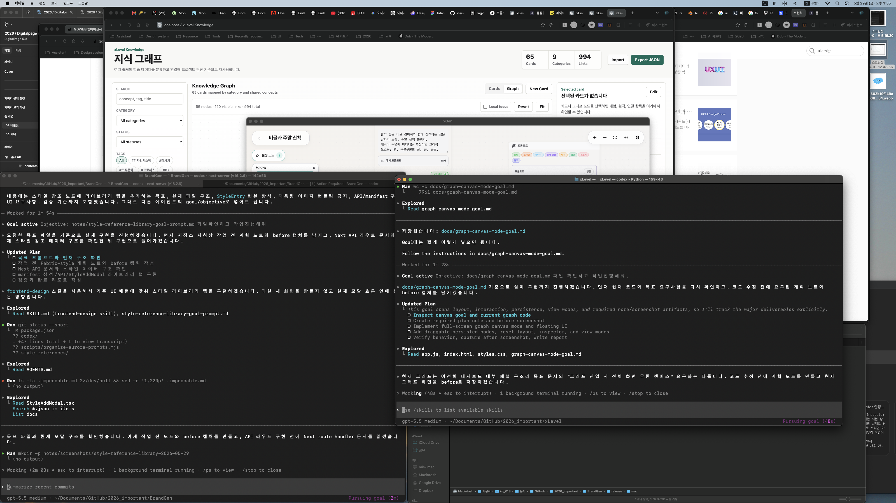

# Fabric Note: Style Reference Library Integration Plan

## Goal

Implement the plan in `notes/style-reference-library-goal-prompt.md`: allow users to add collected local style references from the xGen Style Reference node without manually selecting image files or copying prompts.

## Before Screenshot

## Current State

- `StyleNode` stores references as `StyleEntry` objects with `id`, `imageUrl`, `prompt`, and `label`.
- `StyleAddModal` supports file upload, URL loading, and Codex image analysis.
- Collected references exist in `style-references/aurora-prompts/items/*.json` and `style-references/aurora-prompts/images/*`.
- The reference image directory is large and must not be bundled into the Electron app.

## Work Plan

1. Read the local Next route handler docs before adding API routes.
2. Inspect representative style reference JSON records.
3. Add a manifest builder script that creates a small `data/style-reference-library.json`.
4. Add API routes for metadata and safe image serving.
5. Extend `StyleAddModal` with an `업로드`, `URL`, `라이브러리` segmented flow.
6. Add search, category filters, tag filters, loading, empty, and error states.
7. Convert selected library items into the existing `StyleEntry` shape.
8. Keep existing upload, URL, and Codex analyze workflows working.
9. Verify the build and inspect packaging impact.

## Validation Plan

- Run the manifest build script and inspect output.
- Run targeted ESLint on touched frontend files and app route files.
- Run `npm run build:next`.
- If build succeeds, inspect `.next/standalone` size and traces to confirm the full reference image directory is not bundled unintentionally.

## Risks

- API routes that read local files can be traced into the standalone build if paths are not handled carefully.
- The existing `package.json` already has an unrelated uncommitted script change; avoid overwriting or reverting it.
- The working tree contains large untracked `style-references`, `sample`, and `codex` folders; do not accidentally stage them.
